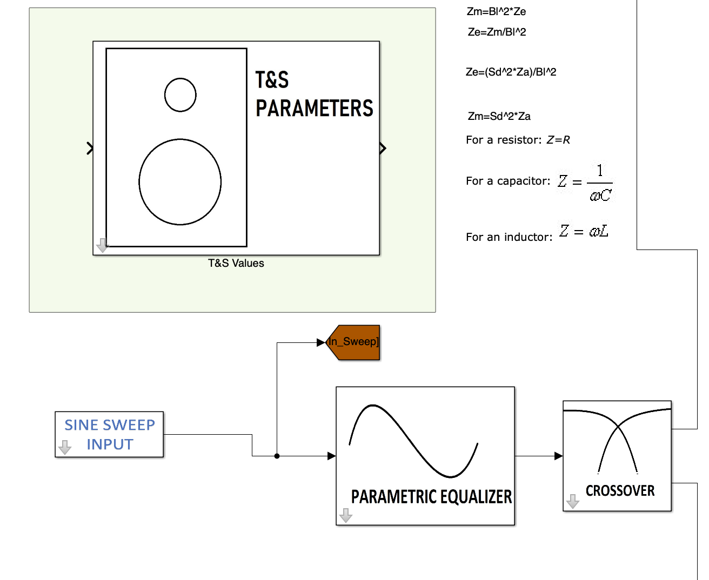

# Loudspeaker Design Tool with Teensy 4 Code Generation


This is a repository for a loudspeaker electroequivalent model, developed for part of a Master’s thesis. 

In order to use the tool a working copy of MATLAB; with the Audio Toolbox, 
Simscape, and Simulink add-ons, is required, in addition to an installed C compiler, such as MinGW. 

Open and run: a_LS_model.slx

Users are able to enter Thiele and Small parameters and view modelled loudspeaker 
frequency responses.



Enter Thiele-Small parameters, input signal duration, Parametric EQ controls, and Crossover parameters here.

The tool produces a .txt file, the contents of which can be uploaded to a Teensy 4.1 microcontroller, 
using the  that Arduino SDK. The Teensy then implements  filtering such as parametric EQ and crossover.   ```

