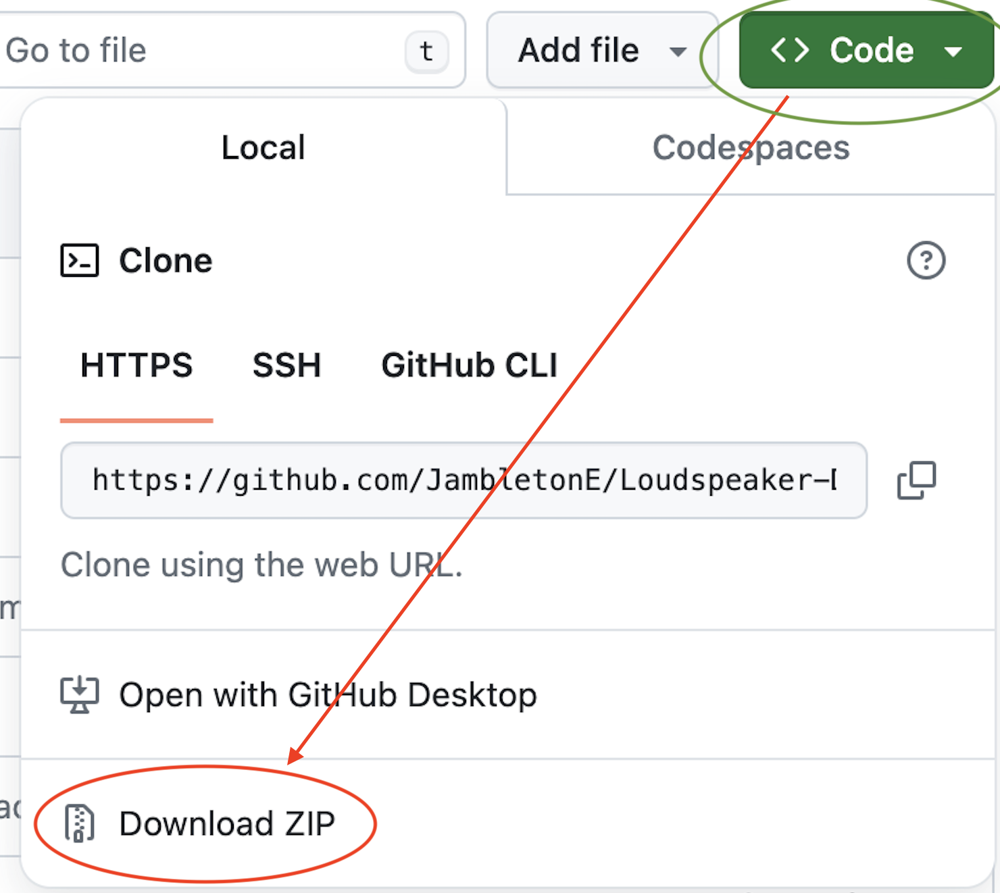

# Loudspeaker Design Tool with Teensy 4 Code Generation

This is a repository for a loudspeaker electroequivalent model, developed for part of a Master’s thesis. 

In order to use the tool a working copy of MATLAB; with the Audio Toolbox, 
Simscape, and Simulink add-ons, is required, in addition to an installed C compiler, such as MinGW. 

You can download a zip file here:

Unzip the file and open: a_LS_model.slx

You will then be presented with:

Underlying code is mainly located in three places. 
Within a subsystem; such as crossover, parametric E, etc, (right click on mask --> look under mask),
Within a subsystem's mask,  (right click on mask --> edit mask),
Within a callback (click on the modelling tab--> model explorer-->callbacks)

The signal chain for both simulation and microcontroller is:

Users are able to enter Thiele and Small parameters and view modelled loudspeaker 
frequency responses.

Enter Thiele-Small parameters, input signal duration, parametric EQ controls, crossover parameters, and delay sttings through the  icons/masks below, view plots here also:

The tool produces a .txt file, the contents of which can be uploaded to a Teensy 4.1 microcontroller. Produced plots can be automatically saved in a folder.

Name both the save .txt and figure folder here:

Uploading of the generated script can be done using the Arduino SDK. The Teensy then implements  filtering such as parametric EQ and crossover, as well as delay, in real time. 

More info on the Teensy and how to upload code can be found here:

https://www.pjrc.com/teensy/index.html

Box resonant modes calculated through clicking on the icon:

Simulation output for frequency and time domain plots can be seen through:

To run the simulation navigate to the Simulation tab and select 'run':

Make sure stop time is set to the same as the sweep time input 

Various outputs of the tool can be seen below, some axis have been edited for readability:

