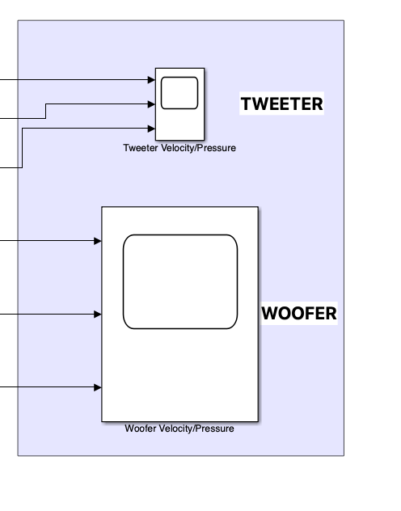

# Loudspeaker Design Tool with Teensy 4 Code Generation


This is a repository for a loudspeaker electroequivalent model, developed for part of a Master’s thesis. 

In order to use the tool a working copy of MATLAB; with the Audio Toolbox, 
Simscape, and Simulink add-ons, is required, in addition to an installed C compiler, such as MinGW. 


Signal chaincan be seen above

Open and run: a_LS_model.slx

Users are able to enter Thiele and Small parameters and view modelled loudspeaker 
frequency responses.


Enter Thiele-Small parameters, input signal duration, Parametric EQ controls, and Crossover parameters here. Go to these parameters to view various plots.


The tool produces a .txt file, the contents of which can be uploaded to a Teensy 4.1 microcontroller. Produce plots can be automatically saved in a folder.


Box resonant modes can be entered and calculated here.



Simulation output for frequency and time domain plots can be seen here.


Name both the save .txt and figure folder here.

Box modes can be 
using the  that Arduino SDK. The Teensy then implements  filtering such as parametric EQ and crossover.   ```

Various outputs of the tool can be seen below, some axis have been edited for readability:


